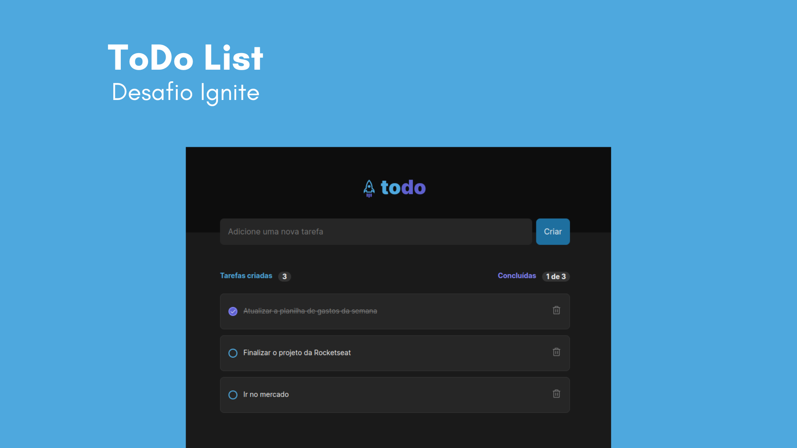

<h1 align="center">ToDo List 📝</h1>

<p align="center">
  
</p>

---

## ✨ About the project

Responsive application developed in React using componentization concepts, properties, states, immutability, hooks and knowledge about data storage in localStorage.

**IGNITE - Challenge 01 > ToDo List.**

---

## ⚙️ Functionalities

[x] The person can add a new task

[x] The person can change the tasks to done

[x] The person can delete the tasks
 
  ---

## 🛠 Tools

- [HTML](https://developer.mozilla.org/en-US/docs/Web/HTML)
- [CSS](https://developer.mozilla.org/en-US/docs/Web/CSS)
- [JavaScript](https://developer.mozilla.org/pt-BR/docs/Web/JavaScript)
- [React](https://reactjs.org/)

---

## 🧑‍💻 How to use

```bash

# Clone this repository
$ git clone git@github.com:ota-mariana/ignite-todo-list-challenge.git

# Access the project folder in your terminal/cmd
$ cd ignite-todo-list-challenge

# Install the dependencies
$ npm install

# Run the application in development mode
$ npm run dev

# The application will open on port:5173 - access http://localhost:5173

```

---

## 🗃️ Utilities

Logo: [Figma](https://www.figma.com/file/gSfeehQ9eY1BSI8axpjKvd/ToDo-List-(Copy)?node-id=0-1&t=ZL9rr8qinGhnLE4l-0)

Font: [Inter](https://fonts.google.com/)

Icons: [Phosphor](https://phosphoricons.com/)

---

## 👤 Autor 
<p align="center">
  
</p>
<p align="center">Mariana Naomi Ota</p>

---

## 📝 License

This project is licensed by [MIT](./LICENSE).

---

<p align="center">Project developed with ❤️ by Mariana Ota</p>
